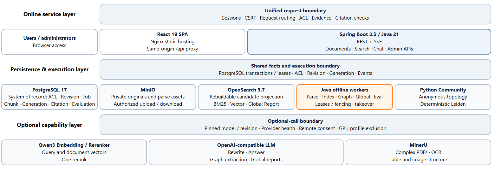
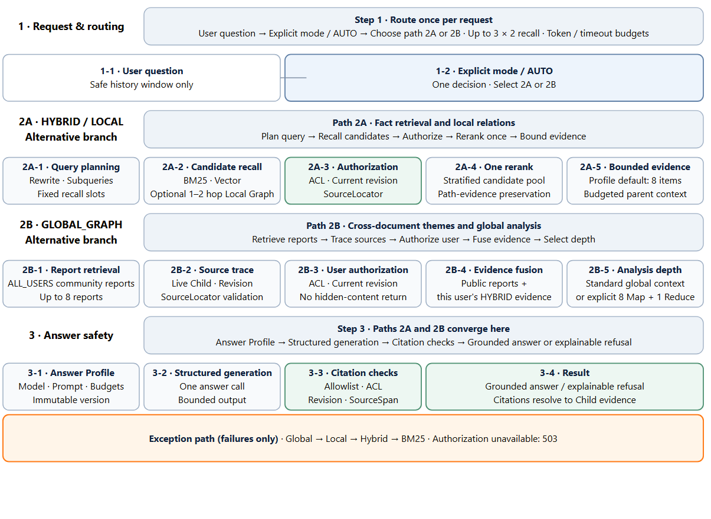

# Zhijing RAG

<p align="center">
  <a href="./README.md">简体中文</a> · <strong>English</strong>
</p>

<p align="center">
  A local-first, multi-format, ACL-aware RAG platform for private knowledge bases
</p>

<p align="center">
  
  
  
  
  
  
  
</p>

Zhijing RAG puts document ingestion, hybrid retrieval, Local/Global GraphRAG, grounded citations, authorization checks, evaluation, and operations on one traceable path. PostgreSQL is the authoritative source for ACLs, current revisions, citations, and generations; OpenSearch contains rebuildable retrieval projections only.

Terminology: a revision is an immutable document version, a Child is a searchable evidence unit, a SourceLocator is a format-native source position, and a generation is an immutable index or graph build.

> [!IMPORTANT]
> This project is under active improvement. The included Compose stack targets local single-machine use and evaluation; it is not a production template that should be exposed to the public internet unchanged.

[Capabilities](#capabilities) · [Quick Start](#quick-start) · [Architecture](#architecture) · [Formats](#supported-formats) · [Models](#models-and-optional-capabilities) · [Evaluation](#evaluation) · [Security](#security-boundaries) · [License](#license)

## Capabilities

| Area | Current implementation |
| --- | --- |
| Multi-format documents | PDF, TXT, Markdown, HTML, DOCX, PPTX, XLSX, and CSV share one upload, revision, pipeline, indexing, and citation lifecycle |
| Traceable citations | Answers cite Child evidence only after live ACL, current-revision, and SourceLocator validation |
| Hybrid retrieval | BM25 plus optional vector recall, RRF fusion, one rerank, an evidence budget, and a final authorization check |
| GraphRAG | Directed adjacency tables in PostgreSQL, immutable graph generations, local multi-hop retrieval, and global community reports |
| Controlled fallback | Model and graph failures use explicit fallback paths; an unavailable PostgreSQL authorization check fails closed |
| User memory | Off by default, user-confirmed, and owner-scoped; document facts must re-enter the evidence and citation path |
| Administration and evaluation | Document pipelines, index/graph publication, bounded subgraph visualization, immutable datasets/runs/baselines, and audit events |

## Quick start

Run these steps after cloning the repository and entering its root directory.

### Requirements

- Docker Desktop or Docker Engine with Compose v2.
- Basic upload, PDFBox/Office parsing, and BM25 retrieval do not require a GPU or an LLM.

### 1. Start the base stack

For a new database, set both bootstrap administrator variables. The password must contain at least 8 characters and at most 72 UTF-8 bytes. Copy [`.env.example`](./.env.example) to `.env` and set a strong password, or set the following environment variables directly.

PowerShell:

```powershell
$env:RAG_ADMIN_USERNAME = "admin"
$env:RAG_ADMIN_PASSWORD = "replace-with-a-strong-password"
docker compose up -d --build
docker compose ps
```

Bash:

```bash
export RAG_ADMIN_USERNAME=admin
export RAG_ADMIN_PASSWORD='replace-with-a-strong-password'
docker compose up -d --build
docker compose ps
```

These variables create the administrator only when it does not exist. Restarting containers does not reset an existing password.

### 2. Open the application

- Web: <http://localhost:5173>
- Backend health: <http://localhost:8080/actuator/health>
- MinIO Console: <http://localhost:9001>

After upload, the platform automatically runs `PARSE → CHUNK → INDEX`. Once a revision is READY and current, it is searchable. Chat can generate cited answers only after an LLM is configured and enabled. Users never build an index manually.

### Local ports

All default host ports bind to `127.0.0.1` only.

| Service | Address | Purpose |
| --- | --- | --- |
| Frontend | `127.0.0.1:5173` | React UI; Nginx proxies `/api` on the same origin |
| Backend | `127.0.0.1:8080` | REST, SSE, and Actuator |
| PostgreSQL | `127.0.0.1:5432` | Authoritative state; local-only port |
| MinIO Console | `127.0.0.1:9001` | Object API `9000` stays inside the container network by default |
| OpenSearch | `127.0.0.1:9200` | Rebuildable search projections; local-only port |
| Community Worker | `127.0.0.1:8001` | Internal Python/Leiden worker |

## Supported formats

Non-PDF documents never receive fabricated page numbers. Every format uses a `SourceLocator` that resolves back to the original structure.

| Format | Parser | Citation location |
| --- | --- | --- |
| PDF | PDFBox; optional MinerU for complex PDFs | Page and page-relative SourceSpan |
| TXT | Purpose-built text parser | Heading, section, and line range |
| Markdown | Safe Markdown parsing | Heading hierarchy, code block, table, and line range |
| HTML | Safe parsing with no remote resources or executable content | Section and DOM Block/Path |
| DOCX | Apache POI | Section, paragraph, and table cell |
| PPTX | Apache POI | Slide, shape, notes, and table cell |
| XLSX | Streaming spreadsheet parser; formulas are never executed | Worksheet and cell range |
| CSV | Streaming encoding, delimiter, and header detection | Table region and cell range |

The default upload limit is 50 MiB. TXT, Markdown, HTML, and CSV also have a 10 MiB parser safety limit.

## Retrieval and answer modes

- `HYBRID`: the default retrieval path. BM25 is always available; vector recall is enabled by configuration.
- `AUTO`: the default Chat request mode. The server makes one request-level choice among `HYBRID`, `LOCAL_GRAPH`, and `GLOBAL_GRAPH`; explicit modes are never rewritten.
- `LOCAL_GRAPH`: seeds entities from currently authorized mentions and aliases, performs bounded one- or two-hop expansion, then returns to the shared rerank and evidence path.
- `GLOBAL_GRAPH`: searches versioned community reports built from sources visible to every authenticated user (`ALL_USERS`), resolves original Child evidence, and fuses it with Hybrid evidence authorized for the current user.
- `DEEP_GLOBAL`: explicit only, with at most eight Map calls and one Reduce call. `AUTO` never triggers it implicitly.

Graph nodes, relationships, and community reports cannot be citations. User-visible citations always anchor to a currently valid source location.

## Architecture

[](./docs/assets/architecture.en.svg "Open the high-resolution SVG")

Read the architecture as three responsibility layers—online services, persistence and execution, and optional capabilities—not as three sequential runtime steps.

### Retrieval and answer paths

The flow is fixed as `1 route → choose 2A or 2B → 3 answer`. Path 2A is the one-rerank HYBRID/LOCAL_GRAPH chain, while path 2B is the Global/Deep Global branch; both converge at the same citation-checking and answer boundary. The active RetrievalProfile freezes the evidence budget; its current default is eight items.

[](./docs/assets/retrieval-flow.en.svg "Open the high-resolution SVG")

The README displays broadly compatible PNG previews; click an image to open its high-resolution SVG.

## Models and optional capabilities

### OpenAI-compatible LLM

Document retrieval works without an LLM. Chat generation, query rewriting, graph extraction, and global reports require the relevant OpenAI-compatible endpoint.

Local endpoint example:

```powershell
$env:LLM_ENABLED = "true"
$env:LLM_BASE_URL = "http://host.docker.internal:11434/v1"
$env:LLM_MODEL = "your-model"
$env:LLM_REVISION = "pinned-model-revision"
$env:LLM_CONTEXT_WINDOW_TOKENS = "8192"
$env:LLM_MAX_OUTPUT_TOKENS = "1024"
$env:LLM_LOCAL_ENDPOINT = "true"
docker compose up -d --build backend evaluation-worker
```

Remote endpoint example:

```powershell
$env:LLM_ENABLED = "true"
$env:LLM_BASE_URL = "https://provider.example/v1"
$env:LLM_MODEL = "your-model"
$env:LLM_REVISION = "pinned-model-revision"
$env:LLM_API_KEY = "your-api-key"
$env:LLM_LOCAL_ENDPOINT = "false"
$env:LLM_REMOTE_EVIDENCE_ALLOWED = "true"
$env:LLM_REMOTE_MEMORY_ALLOWED = "false"
docker compose up -d --build backend evaluation-worker
```

Never mark a remote endpoint as `LLM_LOCAL_ENDPOINT=true`. Enable `LLM_REMOTE_MEMORY_ALLOWED=true` only when personal memory is explicitly allowed to leave the machine; evidence and memory have independent permissions.

Graph extraction has separate `GRAPH_EXTRACTION_*` settings and its own remote-evidence permission. It does not inherit Chat's security switches.

### Embedding and reranking

The `hybrid` profile provides pinned Qwen3 Embedding/Reranker services and requires an NVIDIA GPU with container GPU support:

```powershell
$env:EMBEDDING_ENABLED = "true"
$env:RERANK_ENABLED = "true"
docker compose --profile hybrid up -d --build
```

### GraphRAG

Local graph-extraction endpoint example:

```powershell
$env:GRAPH_EXTRACTION_ENABLED = "true"
$env:GRAPH_EXTRACTION_BASE_URL = "http://host.docker.internal:11434/v1"
$env:GRAPH_EXTRACTION_MODEL = "your-model"
$env:GRAPH_EXTRACTION_REVISION = "pinned-model-revision"
$env:GRAPH_EXTRACTION_LOCAL_ENDPOINT = "true"
docker compose --profile graph up -d --build
```

Remote graph extraction also requires `GRAPH_EXTRACTION_API_KEY`, `GRAPH_EXTRACTION_LOCAL_ENDPOINT=false`, and `GRAPH_EXTRACTION_REMOTE_EVIDENCE_ALLOWED=true`. The `graph` profile only starts build workers: before online `LOCAL_GRAPH` can be used, an administrator must build a READY graph candidate and explicitly publish it. `GLOBAL_GRAPH` additionally requires an independently built and published Global Generation based on eligible `ALL_USERS` sources.

Graph and global builds follow a `BUILDING → READY → ACTIVE/RETIRED` lifecycle:

1. A generation freezes the current READY revisions and ACL versions.
2. Workers build an immutable candidate; failure or interruption never modifies the current ACTIVE generation.
3. An administrator explicitly publishes or rolls back after closure checks.
4. Revision, ACL, deletion, or format changes make affected projections stale; online retrieval skips invalid sources.

Default graph-build safety limits are 1,000 documents, 5,000 Parents, 20 million characters, 50,000 entities, and 100,000 relationships. This is not an unbounded bulk-processing API for arbitrary dataset sizes.

### MinerU

Enable the `mineru` profile for complex layouts and OCR. It shares GPU resource constraints with local model services and should not run together with the `hybrid` profile on an 8 GB GPU.

```powershell
$env:MINERU_ENABLED = "true"
$env:GPU_ACTIVE_PROFILE = "mineru"
docker compose --profile mineru up -d --build
```

Starting the profile alone does not enable the MinerU parser; both switches and a healthy provider are required.

## Evaluation

The Evaluation Center manages immutable datasets, evaluation configurations, runs, and baselines. Real Search/Chat evaluation is disabled by default; after enabling it, a completed run still never changes an online configuration or baseline automatically:

```powershell
$env:EVALUATION_REAL_ENABLED = "true"
docker compose up -d --build backend evaluation-worker
```

Missing prerequisites produce `BLOCKED_PREREQUISITE`; the system does not write fabricated scores.

The local HotpotQA v2 reference evaluation covered 50 cases (25 bridge and 25 comparison) across 500 documents:

| Mode | Complete supporting-revision coverage | Evidence Recall | Retrieval-case p95 |
| --- | ---: | ---: | ---: |
| HYBRID | 84% | 91% | 1,648 ms |
| LOCAL_GRAPH | 92% | 96% | 1,847 ms |

On the same reference evaluation, structured short-answer EM was 62% and F1 was 72.35%. The 100% citation-resolution hard gate means every generated citation passed ACL, revision, and SourceLocator validation; 72% Gold Revision citation coverage means 72% of cases cited every gold supporting revision. These are different denominators. The refusal-contract hard gate was 100%.

> [!NOTE]
> These 50 cases were used for diagnosis and tuning. They are a local reference/validation baseline, not an official HotpotQA leaderboard result or an unseen blind test. The table reports Evaluation RETRIEVAL/LOCAL_GRAPH case duration, not end-to-end Chat latency; hardware and cache warmness were not versioned, so p95 is only a local observation. A rendered answer contains explanations and citation markers, so its token F1 must not be presented as structured short-answer accuracy.

Third-party datasets, derived golden files, import state, and run reports are not published with the repository. Local use must follow each source's license and attribution requirements.

## Security boundaries

- Report suspected vulnerabilities through GitHub Private Vulnerability Reporting as described in the [security policy](./SECURITY.md); do not disclose details in a public issue.
- PostgreSQL is authoritative for ACLs, current revisions, generations, and citations. An OpenSearch hit cannot authorize content by itself.
- The MinIO bucket remains private. Downloads are authorized by the Backend; public object URLs are not returned.
- `/api/v1/admin/**` requires ADMIN. Other business APIs require authentication, and state-changing requests are protected by CSRF.
- Authorization-check failures return an error instead of bypassing the guard. Revocation affects the user's next Search, Chat, Chunk, Citation, and download request.
- Sessions currently live in Backend process memory. A restart requires login again, and horizontal scaling needs additional design work.
- The default Compose stack uses example credentials, HTTP, `SESSION_COOKIE_SECURE=false`, and a disabled OpenSearch Security Plugin. Shared or production environments must replace secrets, enable TLS/authentication, remove database/search/worker host ports, and set secure cookies behind an HTTPS reverse proxy.
- Never commit `.env`, database backups, model tokens, runtime corpora, or screenshots containing user information.

## Stop and clean up

Stop containers while preserving data:

```powershell
docker compose down
```

> [!CAUTION]
> `docker compose down -v` irreversibly deletes the PostgreSQL, MinIO, and OpenSearch volumes. Use it only when you intend to destroy all local data.

## License

Copyright 2026 Ap0lie. Project code is licensed under the [Apache License 2.0](./LICENSE).
