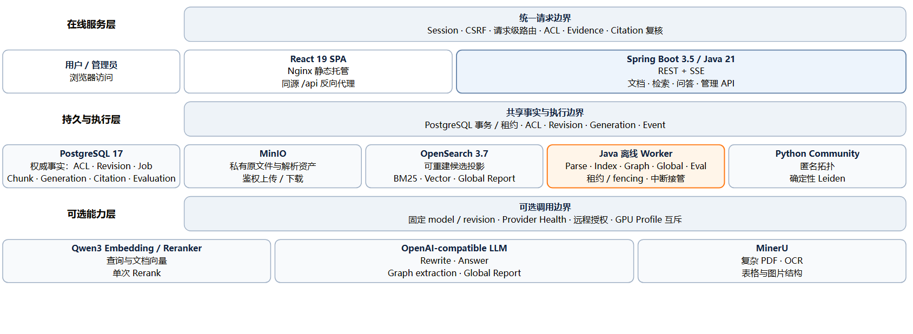
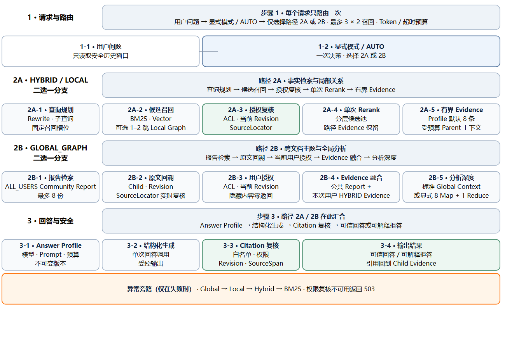

# 知境 RAG

<p align="center">
  <strong>简体中文</strong> · <a href="./README.en.md">English</a>
</p>

<p align="center">
  面向私有知识库的本地优先、多格式、权限感知 RAG 平台
</p>

<p align="center">
  
  
  
  
  
  
  
</p>

知境 RAG 将文档接入、混合检索、Local/Global GraphRAG、证据引用、权限复核、评测与运维放在一条可追溯主链中。PostgreSQL 保存 ACL、当前 Revision、Citation 和 Generation 等权威事实；OpenSearch 只承担可重建的检索投影。

术语约定：Revision 是不可变文档版本，Child 是可检索证据单元，SourceLocator 是格式原生的来源位置，Generation 是不可变的索引或图构建版本。

> [!IMPORTANT]
> 项目仍在持续开发。仓库中的 Compose 面向单机开发与评测，不是可以原样暴露到公网的生产部署模板。

[核心能力](#核心能力) · [快速开始](#快速开始) · [架构](#架构) · [支持格式](#支持格式) · [模型与可选能力](#模型与可选能力) · [评测](#评测) · [安全边界](#安全边界) · [许可证](#许可证)

## 核心能力

| 能力 | 当前实现 |
| --- | --- |
| 多格式文档 | PDF、TXT、Markdown、HTML、DOCX、PPTX、XLSX、CSV 共用同一上传、Revision、Pipeline、索引和引用主链 |
| 可追溯引用 | 回答只引用通过实时 ACL、当前 Revision 和 SourceLocator 复核的 Child Evidence |
| 混合检索 | BM25 与可选向量召回，经 RRF 合并、单次 Rerank、Evidence 预算和最终权限复核 |
| GraphRAG | PostgreSQL 定向邻接表、不可变 Graph Generation、Local 多跳检索、Global Community Report |
| 安全降级 | 模型或图分支不可用时按受控路径降级；PostgreSQL 权限复核不可用时 fail closed |
| 用户记忆 | 默认关闭、用户确认、owner-scoped；文档事实仍必须重新进入 Evidence/Citation 链 |
| 管理与评测 | 文档 Pipeline、索引与图发布、受限子图可视化、不可变 Dataset/Run/Baseline 和操作审计 |

## 快速开始

克隆仓库并进入项目根目录后执行以下步骤。

### 前置条件

- Docker Desktop 或 Docker Engine，支持 Compose v2。
- 基础文档上传、PDFBox/Office 解析和 BM25 检索不要求 GPU 或 LLM。
- 源码测试另需 Node.js 22+、Python 3.12+ 和本机 Google Chrome；它们不是基础启动条件。

### 1. 启动基础服务

首次使用全新数据库时，必须同时设置管理员用户名和密码。密码至少 8 个字符，且不超过 72 UTF-8 bytes。可以复制 [`.env.example`](./.env.example) 为 `.env` 并设置强密码，也可以直接设置以下环境变量。

PowerShell：

```powershell
$env:RAG_ADMIN_USERNAME = "admin"
$env:RAG_ADMIN_PASSWORD = "replace-with-a-strong-password"
docker compose up -d --build
docker compose ps
```

Bash：

```bash
export RAG_ADMIN_USERNAME=admin
export RAG_ADMIN_PASSWORD='replace-with-a-strong-password'
docker compose up -d --build
docker compose ps
```

这两个变量只在管理员不存在时创建账号，不会在容器重启时重置已有密码。

### 2. 打开应用

- Web：<http://localhost:5173>
- Backend health：<http://localhost:8080/actuator/health>
- MinIO Console：<http://localhost:9001>

上传后系统会自动执行 `PARSE → CHUNK → INDEX`。Revision 达到 READY 并成为当前版本后即可搜索；配置并启用 LLM 后，Chat 才能生成带引用回答。两者都不要求用户手动建立索引。

### 本机端口

所有默认宿主端口都只绑定 `127.0.0.1`。

| 服务 | 地址 | 说明 |
| --- | --- | --- |
| Frontend | `127.0.0.1:5173` | React UI；Nginx 同源代理 `/api` |
| Backend | `127.0.0.1:8080` | REST、SSE、Actuator |
| PostgreSQL | `127.0.0.1:5432` | 权威事实库；开发端口 |
| MinIO Console | `127.0.0.1:9001` | 对象 API `9000` 默认只在容器网络内 |
| OpenSearch | `127.0.0.1:9200` | 可重建检索投影；开发端口 |
| Community Worker | `127.0.0.1:8001` | Python/Leiden 内部 Worker |

## 支持格式

非 PDF 文档不会伪造页码。每种格式都使用可回到原始结构位置的 `SourceLocator`。

| 格式 | 解析器 | 引用位置 |
| --- | --- | --- |
| PDF | PDFBox；复杂 PDF 可选 MinerU | 页码与页内 SourceSpan |
| TXT | 定向文本解析器 | 标题、章节、行范围 |
| Markdown | 安全 Markdown 解析 | 标题层级、代码块、表格、行范围 |
| HTML | 无远程资源、无可执行内容的安全解析 | 章节、DOM Block/Path |
| DOCX | Apache POI | 章节、段落、表格单元格 |
| PPTX | Apache POI | 幻灯片、Shape、Notes、表格单元格 |
| XLSX | 流式表格解析，不执行公式 | 工作表与 Cell Range |
| CSV | 流式编码、分隔符和表头检测 | 表格区域与 Cell Range |

默认上传上限为 50 MiB；TXT、Markdown、HTML 和 CSV 另受 10 MiB 的解析安全上限约束。

## 检索与回答模式

- `HYBRID`：默认检索主链。BM25 始终可用，向量分支按配置启用。
- `AUTO`：Chat 的默认请求模式。服务端每个请求只选择一次 `HYBRID`、`LOCAL_GRAPH` 或 `GLOBAL_GRAPH`，显式模式不会被改写。
- `LOCAL_GRAPH`：从当前授权 Mention/Alias 建立实体种子，执行受限 1–2 跳路径扩展，再回到统一 Rerank 与 Evidence 链。
- `GLOBAL_GRAPH`：检索由所有已登录用户可见的 `ALL_USERS` 来源构建版本化 Community Report，回溯原始 Child Evidence，并与本次用户已授权的 Hybrid Evidence 融合。
- `DEEP_GLOBAL`：只能显式选择，最多执行 8 次 Map 和 1 次 Reduce；`AUTO` 不会隐式触发。

Graph 节点、关系和 Community Report 本身不能成为 Citation；用户看到的引用始终锚定当前有效的原文位置。

## 架构

[](./docs/assets/architecture.zh-CN.svg "点击查看 SVG 高清版本")

架构图按“在线服务层、持久与执行层、可选能力层”阅读，表示职责分层，不表示三个阶段依次执行。

### 检索与回答主链

流程固定为 `1 路由 → 2A/2B 二选一 → 3 回答`。2A 是 HYBRID/LOCAL_GRAPH 的单次 Rerank 主链，2B 是 Global/Deep Global 分支；两条路径最终进入同一 Citation 复核与回答边界。Evidence 数量由当前 RetrievalProfile 冻结，当前默认值为 8。

[](./docs/assets/retrieval-flow.zh-CN.svg "点击查看 SVG 高清版本")

README 显示兼容性更好的 PNG，点击图片可查看 SVG 高清版本。图源位于 [`docs/diagrams`](./docs/diagrams)，使用锁定的 Mermaid CLI、Puppeteer 和 Chrome Headless Shell（Chromium）生成；不要手工编辑生成文件。

## 模型与可选能力

### OpenAI-compatible LLM

文档检索可以不配置 LLM；Chat 生成、Query Rewrite、图谱抽取和 Global Report 需要相应的 OpenAI-compatible endpoint。

本地 endpoint 示例：

```powershell
$env:LLM_ENABLED = "true"
$env:LLM_BASE_URL = "http://host.docker.internal:11434/v1"
$env:LLM_MODEL = "your-model"
$env:LLM_REVISION = "pinned-model-revision"
$env:LLM_CONTEXT_WINDOW_TOKENS = "8192"
$env:LLM_MAX_OUTPUT_TOKENS = "1024"
$env:LLM_LOCAL_ENDPOINT = "true"
docker compose up -d --build backend evaluation-worker
```

远程 endpoint 示例：

```powershell
$env:LLM_ENABLED = "true"
$env:LLM_BASE_URL = "https://provider.example/v1"
$env:LLM_MODEL = "your-model"
$env:LLM_REVISION = "pinned-model-revision"
$env:LLM_API_KEY = "your-api-key"
$env:LLM_LOCAL_ENDPOINT = "false"
$env:LLM_REMOTE_EVIDENCE_ALLOWED = "true"
$env:LLM_REMOTE_MEMORY_ALLOWED = "false"
docker compose up -d --build backend evaluation-worker
```

不得把远程 endpoint 标记为 `LLM_LOCAL_ENDPOINT=true`。只有在明确允许个人记忆离开本机时才启用 `LLM_REMOTE_MEMORY_ALLOWED=true`；Evidence 与 Memory 使用彼此独立的许可。

Graph extraction 使用独立的 `GRAPH_EXTRACTION_*` 配置与远程 Evidence 许可，不会继承 Chat 的安全开关。

### Embedding 与 Reranker

`hybrid` Profile 提供固定版本的 Qwen3 Embedding/Reranker 服务，需要 NVIDIA GPU 与容器 GPU 支持：

```powershell
$env:EMBEDDING_ENABLED = "true"
$env:RERANK_ENABLED = "true"
docker compose --profile hybrid up -d --build
```

### GraphRAG

本地图谱抽取 endpoint 示例：

```powershell
$env:GRAPH_EXTRACTION_ENABLED = "true"
$env:GRAPH_EXTRACTION_BASE_URL = "http://host.docker.internal:11434/v1"
$env:GRAPH_EXTRACTION_MODEL = "your-model"
$env:GRAPH_EXTRACTION_REVISION = "pinned-model-revision"
$env:GRAPH_EXTRACTION_LOCAL_ENDPOINT = "true"
docker compose --profile graph up -d --build
```

远程图谱抽取还必须设置 `GRAPH_EXTRACTION_API_KEY`、`GRAPH_EXTRACTION_LOCAL_ENDPOINT=false` 与 `GRAPH_EXTRACTION_REMOTE_EVIDENCE_ALLOWED=true`。`graph` Profile 只启动构建 Worker：启用在线 `LOCAL_GRAPH` 前仍需创建 READY Graph 候选并由管理员显式发布；`GLOBAL_GRAPH` 还需基于合规的 `ALL_USERS` 来源独立构建并发布 Global Generation。

Graph/Global 构建遵循 `BUILDING → READY → ACTIVE/RETIRED` 生命周期：

1. Generation 冻结当前 READY Revision 与 ACL 版本。
2. Worker 构建不可变候选；失败或中断不会修改当前 ACTIVE。
3. 管理员核对闭包后显式发布或回滚。
4. Revision、ACL、删除或格式变化会把相关投影标为 stale，在线跳过失效来源。

默认 Graph 构建安全上限为 1,000 个文档、5,000 个 Parent、2,000 万字符、50,000 个实体和 100,000 条关系。它不是面向任意规模数据集的无限批处理接口。

### MinerU

复杂版式与 OCR 可启用 `mineru` Profile。它与本地模型共享 GPU 资源约束，不应在 8 GB GPU 上与 `hybrid` Profile 同时运行。

```powershell
$env:MINERU_ENABLED = "true"
$env:GPU_ACTIVE_PROFILE = "mineru"
docker compose --profile mineru up -d --build
```

仅启动 Profile 不会启用 MinerU Parser；两个开关必须与 Provider 健康状态同时满足。

## 评测

Evaluation Center 管理不可变 Dataset/Subject/Run/Baseline，并使用 PostgreSQL 租约调度。真实 Search/Chat 评测默认关闭；启用后，Run 完成仍不会自动改变线上配置或 Baseline：

```powershell
$env:EVALUATION_REAL_ENABLED = "true"
docker compose up -d --build backend evaluation-worker
```

前置条件缺失时 Run 显示 `BLOCKED_PREREQUISITE`，不会写入伪造分数。

HotpotQA v2 本地开发评测使用固定 revision `1908d6afbbead072334abe2965f91bd2709910ab` 的 `distractor/validation/hard`，包含 50 个 Case（25 bridge、25 comparison）和 500 份文档；检索使用 Index Generation 7，Local Graph 使用未发布的 READY Graph Generation 8：

| 模式 | 双支撑 Revision 完整率 | Evidence Recall | 检索 Case p95 |
| --- | ---: | ---: | ---: |
| HYBRID | 84% | 91% | 1,648 ms |
| LOCAL_GRAPH | 92% | 96% | 1,847 ms |

同一开发评测中的结构化短答案为 EM 62%、F1 72.35%。Citation 解析硬门禁 100% 表示每个已生成引用均通过 ACL、Revision 与 SourceLocator 复核；Gold Revision Citation 覆盖率 72% 表示 72% 的 Case 引用了全部 Gold 支撑 Revision，两者口径不同。Refusal Contract 硬门禁为 100%。

> [!NOTE]
> 这 50 个 Case 已用于诊断与调优，属于本地开发/验证基线，不是 HotpotQA 官方排行榜结果，也不是未见盲测。表中 p95 是 Evaluation 的 RETRIEVAL/LOCAL_GRAPH Case 耗时，不是端到端 Chat 延迟；硬件与缓存冷热尚未版本化，因此仅作为本机观察值。完整渲染回答包含解释和引用标记，不能用其 token F1 代替结构化短答案准确度。

第三方数据集、派生 Golden、导入状态和运行报告均不随仓库提交。请在遵守来源许可证的前提下使用 [`tools/build_hotpotqa_golden.py`](./tools/build_hotpotqa_golden.py) 本地生成，再通过 [`tools/run_hotpotqa_evaluation.py`](./tools/run_hotpotqa_evaluation.py) 与 [`tools/run_hotpotqa_retrieval_comparison.py`](./tools/run_hotpotqa_retrieval_comparison.py) 执行。

## 测试

Backend（Maven 测试与 JaCoCo 门禁）：

```powershell
docker compose --profile test run --build --rm --volume "${PWD}\backend\target:/workspace/target" backend-test
```

Python Community Worker：

```powershell
docker compose run --build --rm worker pytest -q
```

Frontend：

```powershell
Push-Location frontend
try {
  npm ci
  npm run test:coverage
  npm run build
} finally {
  Pop-Location
}
```

启动完整 Stack 后可运行浏览器 E2E：

```powershell
Push-Location frontend
try {
  npm run test:e2e
} finally {
  Pop-Location
}
```

MinerU contract tests：

```powershell
python -m unittest discover mineru/tests -v
```

## 安全边界

- 发现潜在漏洞时，请按 [安全策略](./SECURITY.md) 使用 GitHub 私密漏洞报告，不要在公开 Issue 中披露细节。
- PostgreSQL 是 ACL、当前 Revision、Generation 和 Citation 的权威来源；OpenSearch 命中不能单独授权正文。
- MinIO bucket 保持私有，下载由 Backend 鉴权，不返回公共对象 URL。
- `/api/v1/admin/**` 仅允许 ADMIN；其余业务 API 要求登录，状态变更请求受 CSRF 保护。
- 权限复核失败时返回错误而不是绕过；撤权后下一次 Search、Chat、Chunk、Citation 和下载立即按新权限执行。
- Session 当前保存在 Backend 进程内存中；重启需要重新登录，不适合未经改造直接横向扩容。
- 默认 Compose 使用开发凭据、HTTP、`SESSION_COOKIE_SECURE=false`，并关闭 OpenSearch Security Plugin。共享或生产环境必须更换 Secrets、启用 TLS/Auth、移除数据库/搜索/Worker 宿主端口，并通过 HTTPS 反向代理设置安全 Cookie。
- 不要提交 `.env`、数据库备份、模型 Token、运行语料或含用户信息的截图。

## 仓库结构

```text
backend/    Spring Boot API、领域服务、Flyway、Java Workers 与测试
frontend/   React SPA、Nginx 配置、Vitest 与 Playwright
worker/     Python Community Worker 与 Leiden 图算法
mineru/     可选 MinerU Provider 与 contract tests
tools/      第三方数据集构建、导入与评测工具
data/       仅本地数据、派生语料、运行报告与备份；整个目录不提交
compose.yaml
```

## 停止与清理

停止容器但保留数据：

```powershell
docker compose down
```

> [!CAUTION]
> `docker compose down -v` 会不可恢复地删除 PostgreSQL、MinIO 和 OpenSearch 卷。仅在明确要销毁全部本地数据时使用。

## 公开发布前

- 项目代码使用 [Apache License 2.0](./LICENSE)；第三方组件与数据仍适用各自的许可证。
- HotpotQA、CRUD_RAG 等第三方数据集及其派生物不随仓库提交；本地使用仍须遵守各自许可证和署名要求。
- 公开仓库前应轮换曾在本地使用的密钥，并检查 Git 历史、备份、评测语料和截图。

## 许可证

Copyright 2026 Ap0lie。项目代码依据 [Apache License 2.0](./LICENSE) 授权。

---

如果你正在评估或扩展该项目，建议先从基础 BM25 文档闭环开始，再按顺序启用 Embedding/Reranker、Graph extraction 与 Global GraphRAG；每一步都使用 Evaluation Center 固定版本和记录基线。
